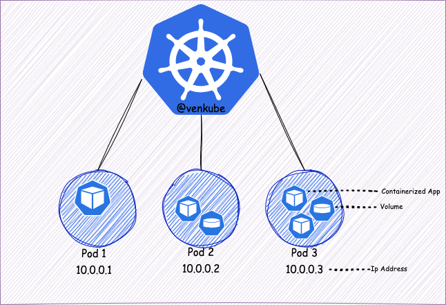
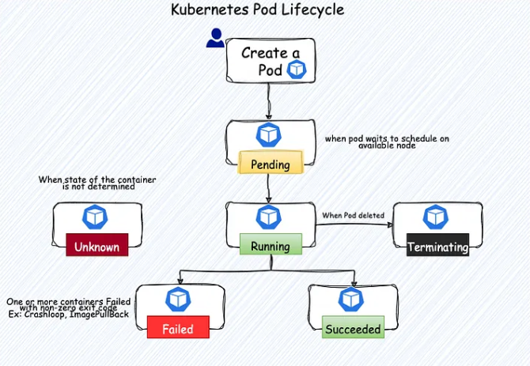
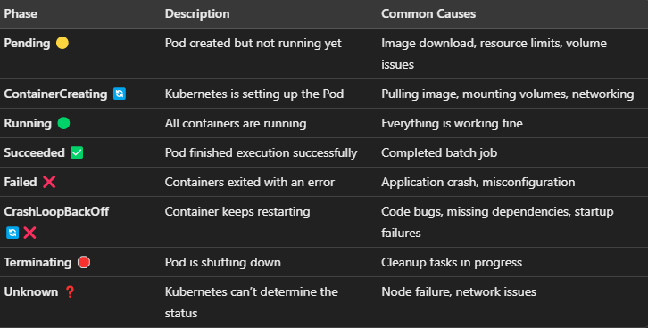
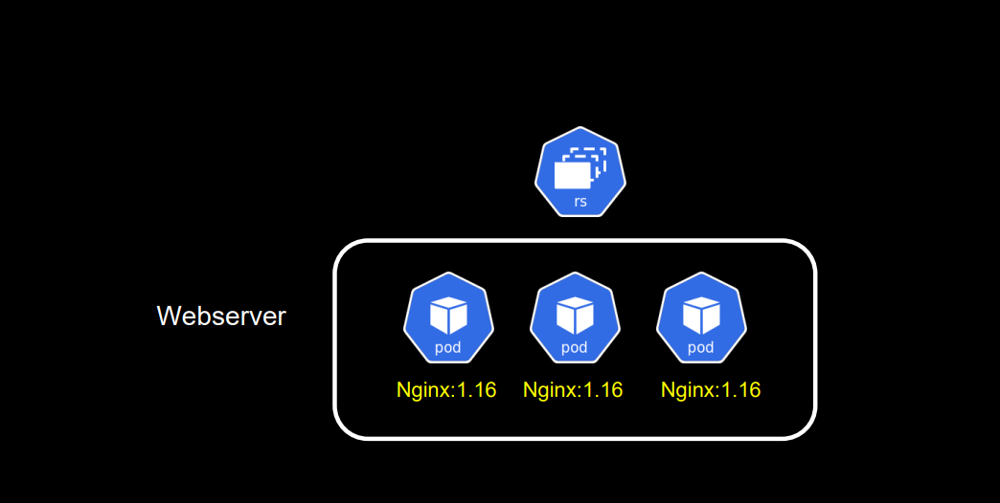
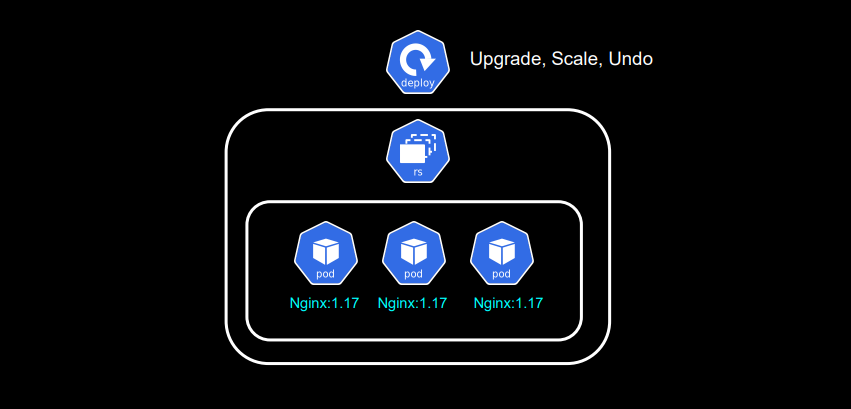

# Pod
A Pod is the smallest and simplest unit in Kubernetes. It represents a single instance of a running process in your cluster

A Pod encapsulates:
- One or more containers (usually Docker containers).
- Storage (volumes) if needed.
- Networking (each Pod gets a unique IP).
- Configuration (like environment variables).



## Commands associated with Pod
```
kubectl run my-pod --image=nginx --restart=Never
kubectl get pods
kubectl describe pod my-pod
kubectl delete pod my-pod
```





# Replica Set

## Why is a ReplicaSet Important?

- Ensures high availability – Keeps your application running by maintaining the desired number of Pods.
- Self-healing – If a Pod fails, it gets replaced automatically.
- Scalability – You can increase or decrease the number of Pods easily.

## what is Replica set.
A ReplicaSet (RS) is a Kubernetes object that ensures a specified number of identical Pods are always running. 
If a Pod crashes or gets deleted, the ReplicaSet automatically creates a new one to maintain the desired number of replicas.



## When to Use a ReplicaSet?
- If you only need to maintain a fixed number of Pods without updates.
- If you don’t need rolling updates or rollbacks

In most cases, use a Deployment instead, because it automatically creates a ReplicaSet and handles updates better

## Commands associated with deployment.
```bash
kubectl create rs my-app-rs --image=nginx --replicas=3 ::- To create replicaset.
kubectl scale rs my-app-rs --replicas=5
kubectl delete rs my-app-rs
```

# Deployment

## Understanding Deployment with an exmaple.
Imagine you run a pizza delivery service (your app).

- You need three delivery drivers (Pods) at all times.
- If a driver gets sick (Pod crashes), you want to hire a replacement automatically (Kubernetes ensures desired state).
- If more orders come in, you hire more drivers (scale up).
- When it’s less busy, you reduce the number of drivers (scale down).
- When a better delivery app version is available, you gradually update drivers to use it without stopping deliveries (rolling update).


You tell Kubernetes what you want – You create a Deployment and specify things like:

- What application to run (e.g., a web server).
- How many copies (replicas) of the app should run.
- What to do if something crashes.
- How updates should be handled.


## what is a Deployment
```bash
A Kubernetes Deployment is a way to manage and control how your application runs in a Kubernetes cluster.
It ensures your application is always available, scalable, and can be updated without downtime.
```



## key Features of Deployment

- ```Manages Pods```: A Deployment ensures the correct number of Pods (small units running your app inside containers) are always up and running.
- ```Handles Updates```: You can update your app smoothly using rolling updates, ensuring no downtime.
- ```Ensures High Availability```: If a Pod crashes, Kubernetes automatically replaces it.
- ```Allows Scaling```: You can easily scale up (add more Pods) or scale down based on demand.

## Commands associated with deployemnt
```bash
kubectl create deployment my-app --image=my-app:v1 ::- Kubernetes automatically creates a ReplicaSet and Pods for it
kubectl get deployments
kubectl describe deployment
kubectl scale deployment my-app --replicas=5
kubectl set image deployment/my-app my-app-container=my-app:v2 ::- Rolling update.
kubectl rollout status deployment/my-app ::- rollout status of deployment
kubectl rollout undo deployment/my-app ::- To undo the version
kubectl delete deployment my-app ::- To delete the deployment.
kubectl rollout history deployment my-app ::- To view Rollout history.
kubectl get pods -l app=my-app ::- To view the pods responsible for the deployment.
```
