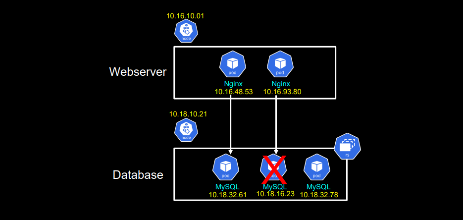
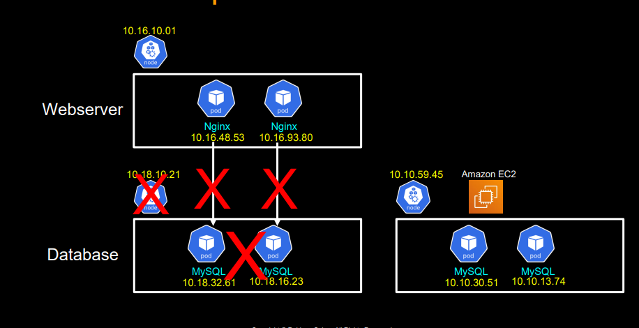
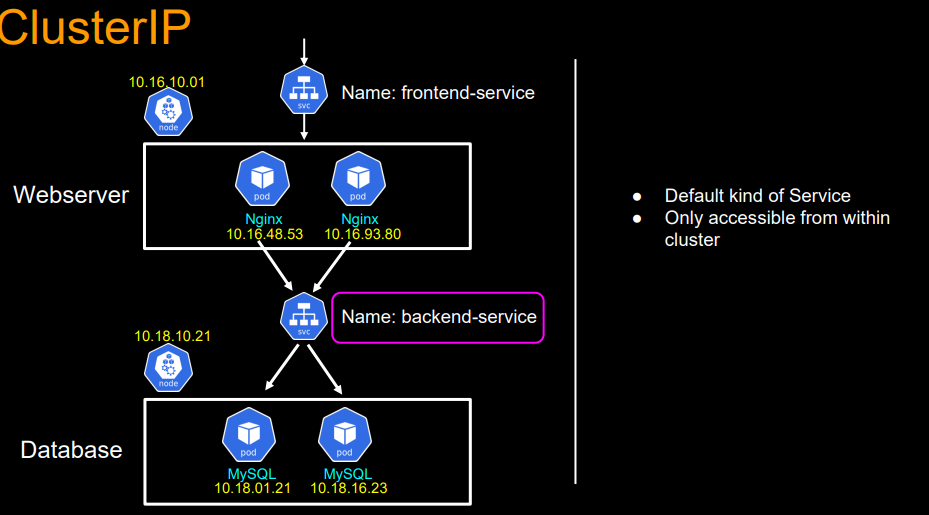
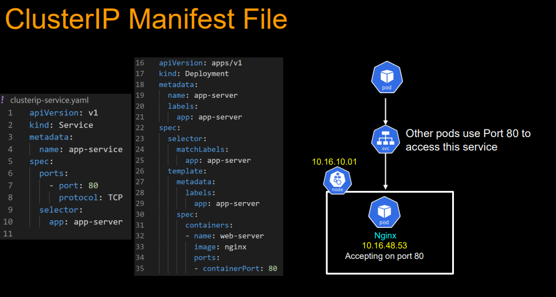
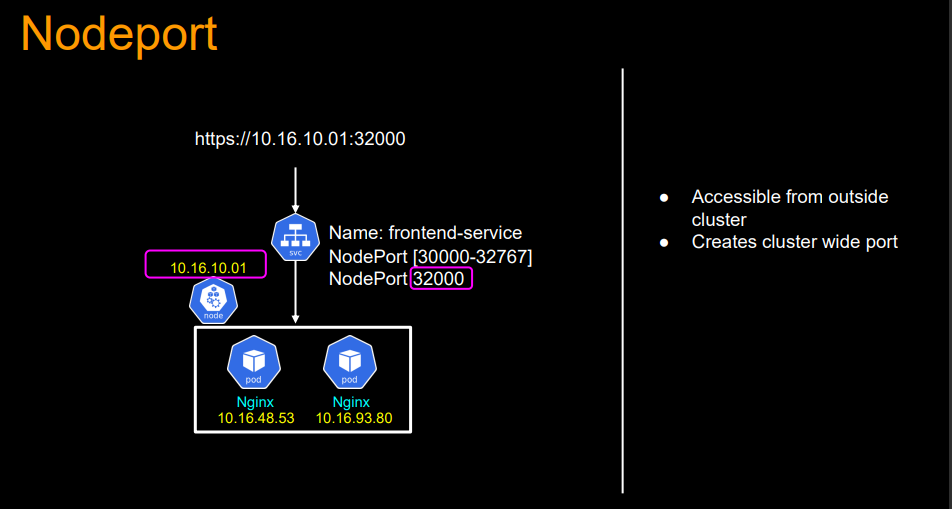
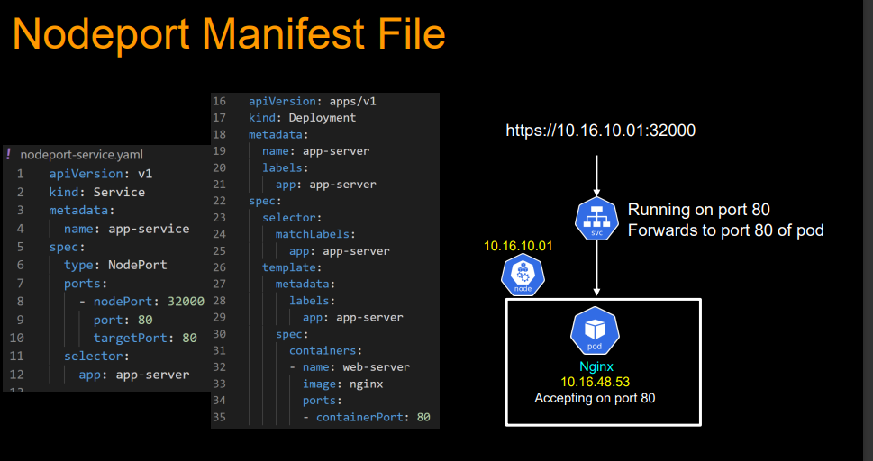
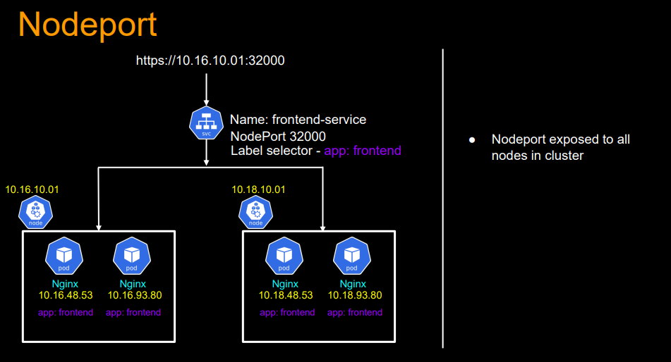
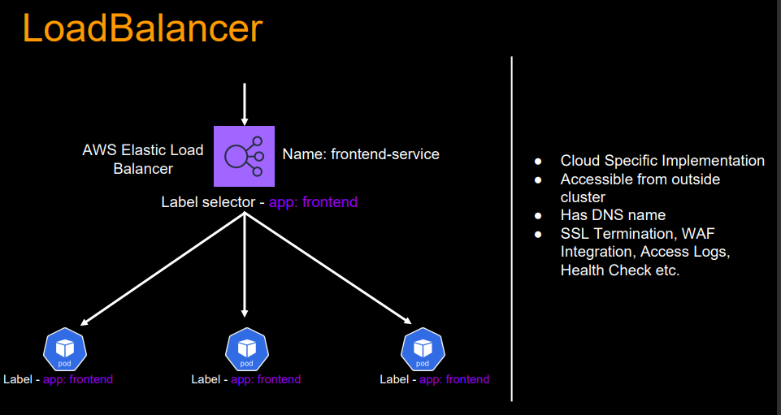

# Service in Kubernetes.


## What problems does the service solves:

Imagine we have front application in node1 which needs to access Backend(MySQL) pods. One of the way to access is using the IP address of the pod.
- what if the pod fails, rs will create new pod which comes new IP:- which again needs to be updated to frontend apps pods
- what if Backend apps needs to service  more traffic:- which needs update






## What is service.

```bash
Kubernetes Services provide consistent, reliable communication between applications by abstracting dynamic Pod IPs, enabling load balancing, service discovery, and external access.
They are essential for building scalable, resilient microservices in Kubernetes
```

## service manifest example.

```bash
apiVersion: v1
kind: Service
metadata:
  name: my-service
spec:
  selector:
    app: my-app
  ports:

## Types of service
- CluserIP
- NodePort
- Load Balancer.
    - protocol: TCP
      port: 80
      targetPort: 8080
  type: ClusterIP
```
## Types for service.
- Cluster IP
- Node Port
- Load Balancer

## Cluster IP
- Exposes the service internally within the cluster.
- Cannot be accessed from outside the cluster.




## Node Port
- Exposes the service externally by assigning a static port (30000-32767) on each Node.
- Can be accessed via ```<NodeIP>:<NodePort>```

### Use cases
- Useful for testing or accessing a service from outside the cluster without a LoadBalancer.
- Not recommended for production due to security concerns.





## Load Balancer.
- Exposes the service externally using a cloud provider’s Load Balancer.
- Works with AWS, Azure, GCP, etc.
- Used for production deployments where external users need access.
- Ideal for web applications, APIs, and mobile backend services.


